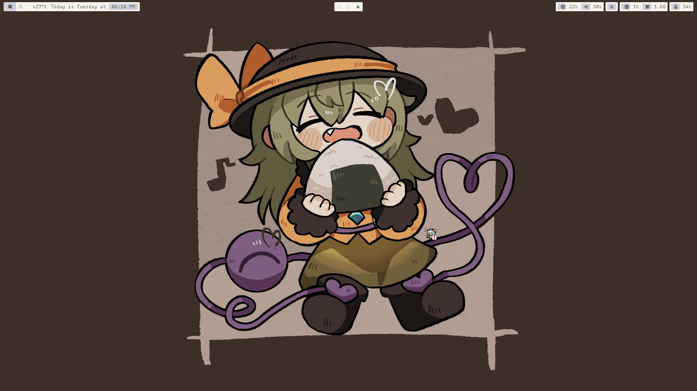
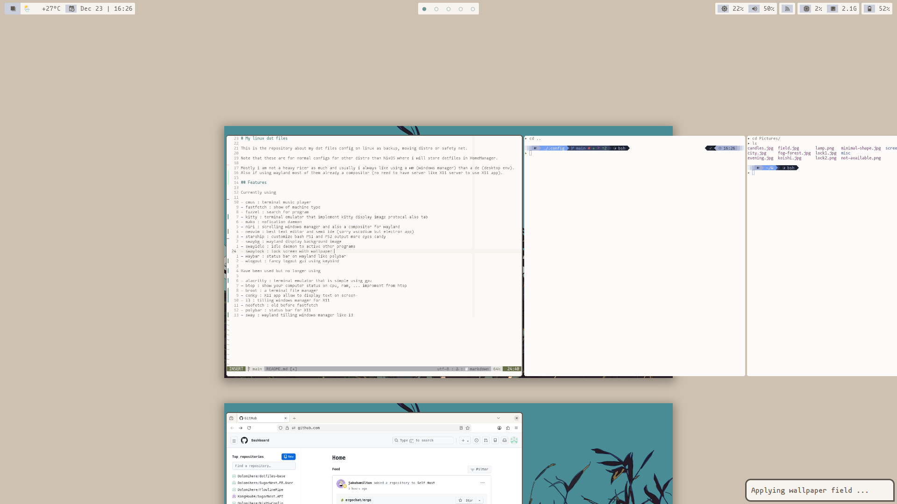
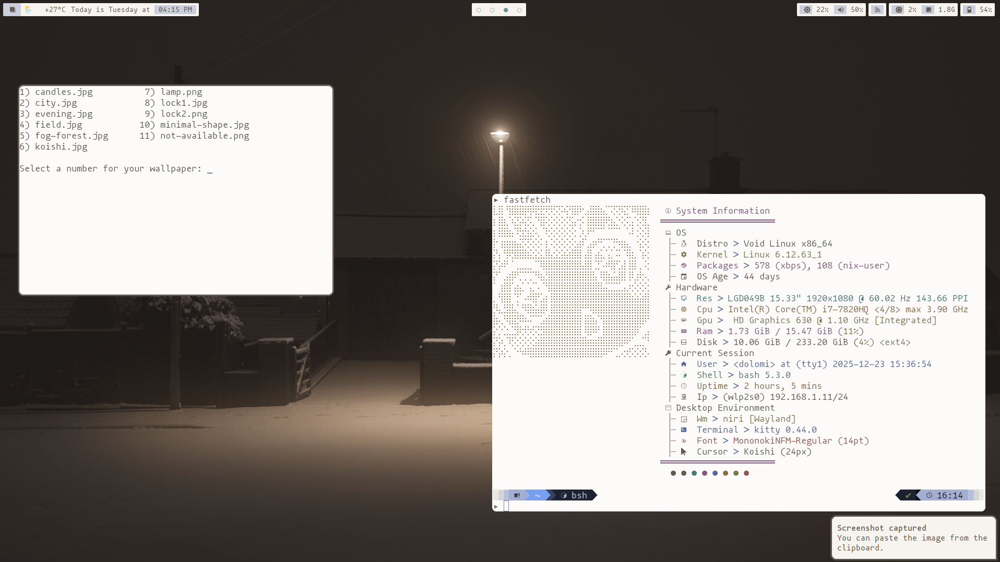
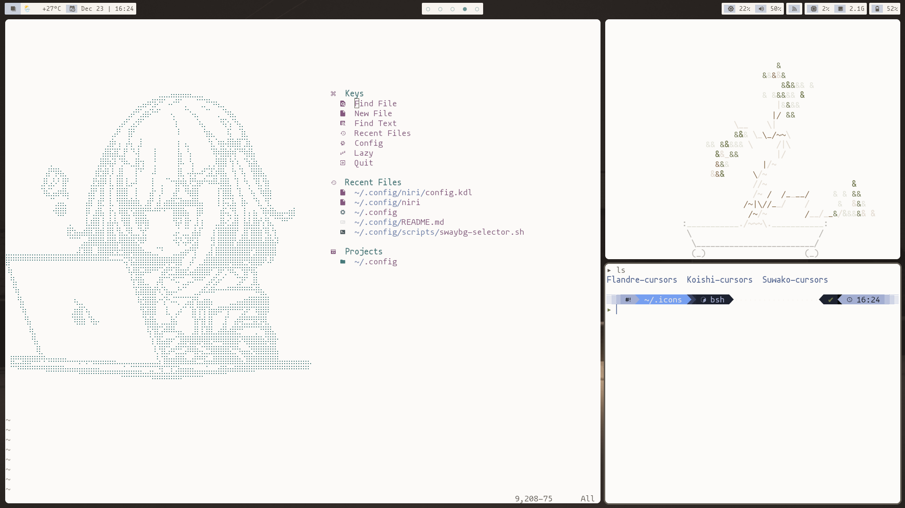
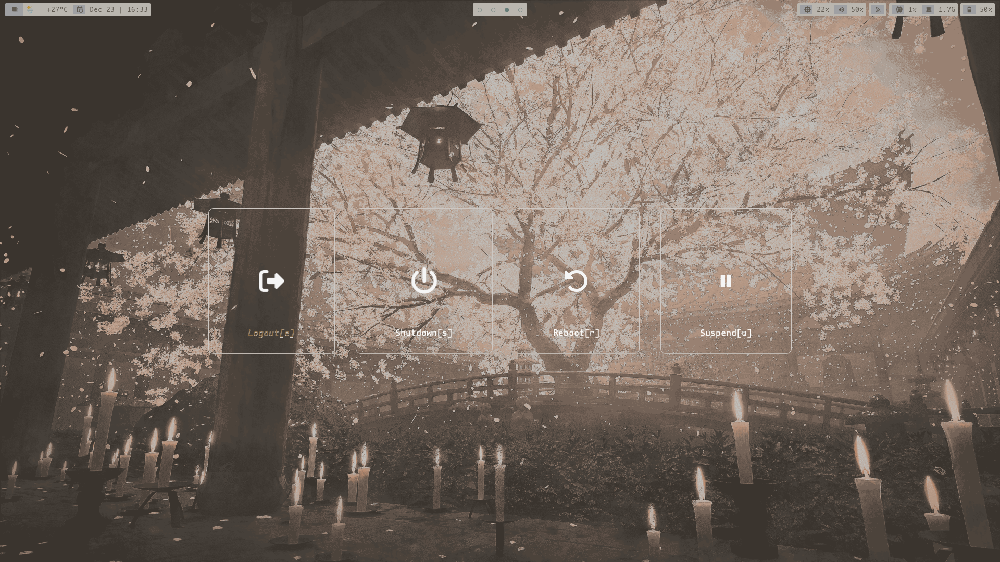

# My linux dot files

This is the repository about my dot files config on linux as backup, moving distro or safety net.

Note that these are for normal configs for other distro than NixOS where i will store dotfiles in HomeManager.

Mostly i am not a heavy ricer as much and usually i always like using a wm (windows manager) than a de (desktop env).
Also if using wayland most of them already a compositor (no need to have server like X11 server to use X11 app).

## Features

Currently using

- cmus : terminal music player
- fastfetch : show of machine type
- fuzzel : search for program
- kitty : terminal emulator that implement kitty display image protocal also tab
- mako : nofication daemon
- niri : scrolling windows manager and also a compositor for wayland
- neovim : best text editor and semi ide (sorry vscodium but electron app)
- starship : customize bash PS1 and PS2 output more eyes candy
- swaybg : wayland display background image
- swayidle : idle daemon to active other programs
- swaylock : lock screen with wallpaper
- waybar : status bar on wayland like polybar
- wlogout : fancy logout gui using keybind

Have been used but no longer using

- alacritty : terminal emulator that is simple using gpu
- btop : show your computer status on cpu, ram, ... improment from htop
- broot : a terminal file manager
- conky : X11 app allow to display text on screen 
- i3 : tilling windows manager for X11
- neofetch : old before fastfetch
- polybar : status bar for X11
- sway : wayland tilling windows manager like i3

## ScreenShot

Overview *

