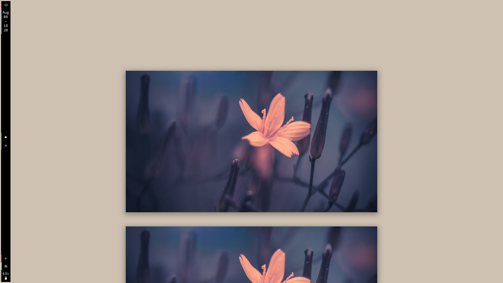
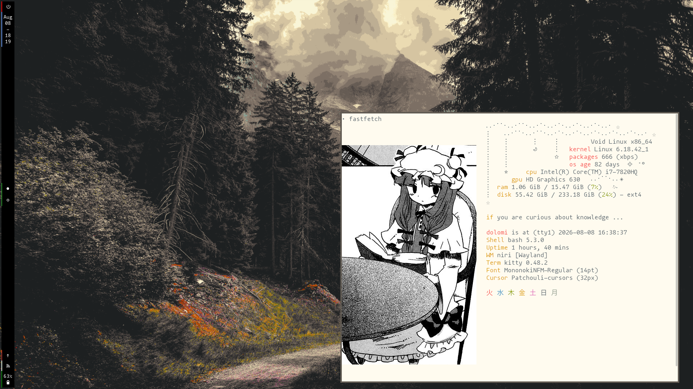
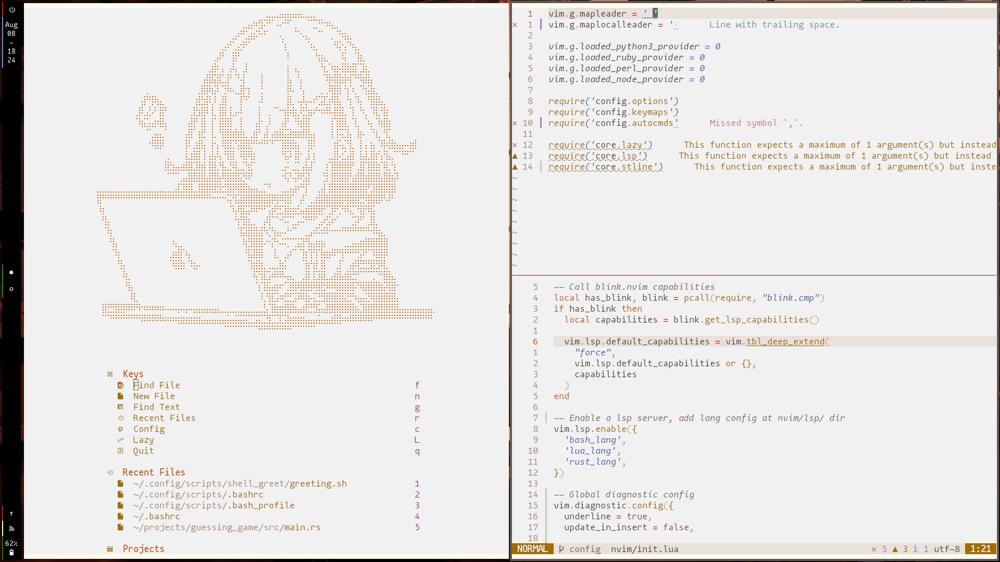
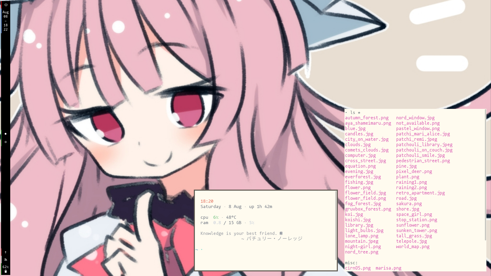

# My linux dot files

This is the repository about my dot files config on linux as backup, moving distro or safety net.
They are very minimal in my eyes and does not use much like most rice on r/unixporn out there.

Most of these should be using no external dependency other than some scripts to call (minimal essential like swaybg and fuzzel)
or different init system on other distro (the only things might break this is musl or running inside container minimal chroot 
though i build up void linux in base-container instead base-system package).

Note that these are for normal configs, for other distro than NixOS where i will store dotfiles in HomeManager.

Mostly i am not a heavy ricer as much and usually i always like using a wm (window manager) than a de (desktop env).
Also if using wayland most of them already a compositor (no need to have server like X11 server to use X11 app).

I am very happy with it and this will probably the last ricing i would like to do after almost 1 year into Linux 
(also move this repo to GitBerg since GiHub lately have been down many time and shady practice).

## Features

Currently using

- fastfetch : show of machine type
- fuzzel : search for program
- kitty : terminal emulator that implement kitty display image protocal also tab
- mako : notification daemon
- niri : scrolling windows manager and also a compositor for wayland
- neovim : best text editor and semi ide (sorry vscodium but electron app)
- starship : customize bash PS1 and PS2 output more eye candy
- swaybg : wayland display background image
- swayidle : idle daemon to active other programs
- swaylock : lock screen with wallpaper
- waybar : status bar on wayland like polybar
- wlogout : fancy logout gui using keybind

Have been used some of these packages but no longer using

- alacritty : terminal emulator that is simple using gpu
- btop : show your computer status on cpu, ram, ... improvement from htop
- broot : a terminal file manager
- cmus : terminal music player
- conky : X11 app allow to display text on screen 
- i3 : tiling windows manager for X11
- neofetch : old before fastfetch
- polybar : status bar for X11
- sway : wayland tiling windows manager like i3

## Screenshot

Overview *

